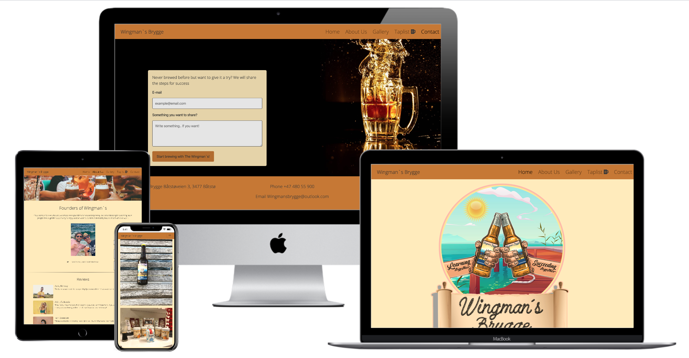

# Wingman`s Brygge #
_True passion for exclusive and well made beer._

  

[View the live project here](https://carhul.github.io/Wingmans-Brygge/)

## Table of Contents ## 

* [Introduction & project goals](#introduction--project-goals)
* [UX](#ux)      
    * [User stories](#user-stories)
    * [Development planes](#development-planes)      
    * [Design](#design)  
    * [Features](#features)  
      * Existing features  
      * Features that will be implemented in the future
* [Technologies](#technologies)    
* [Testing](#testing)  
* [Bugs](#bugs)  
* [Deployment](#deployment)    
* [Credit](#credit)  
* [Acknowledgements](#acknowledgements)  
---
   
### Introduction & Project Goals ###  

Who is The Wingmans? The Wingmans are two middle-aged men who just loves beer! So they made it their hobby. They love to discover new tastes, recreate them or make a brand new. They also love to meet new people and are often spotted in the local bar - with a beer.

This project`s goal is to help the site owners - the founders of Wingmans, to achieve their goal of inspiring others with their passion for home brew, and maybe along the way make some new acquaintances.  

This is the first of four Milestone Projects that I (the developer) must complete during my Full Stack Web Development Program at The Code Institute, and I´m very grateful for The Wingmans trust in me for makeing their first website. 

The main requirements in this project is to make a responsive and static website with a minimum of three pages, using primarily HTML5 and CSS3.
    
    Note; the review section is fictional as this is a new approach for The Wingmans.  
    It needed to be included as part of the assessment criteria. 
    But is highly relevant as it will be updated with real reviews in the future.

## UX ##

### User Stories ###  
* As a user I want to see a nice and inspiring website who makes me want to learn more about home brew  
* As a user I want to know the founders vision  
* As a user I want to see pictures of the founders and the home brew in action  
* As a user I want to read reviews from others who have had contact with the founders  
* As a user I want the ability to contact the founders for questions and guidance, and I also want the ability to let them contact me by leaving my e-mail address.

### Development planes ###  

In order to create a website that fulfilled the expectations as described above, I worked closely with the founders throughout the process.  

### Strategy ###  
  
Divided into two categories, the website will focus on the following target audiences:  
  
  * ### Demographic: ###  
    
    * 25 - 55 year olds  
    * Particularly interested in homebrew  

  * ### Psychographics: ###  
    
    * Personality & Attitudes:  
      * Quality conscious  
      * Social  

    * ### Values: ###  

      * Appreciates new acquaintances  
      * You only live once  
    
    * ### Lifestyles: ###  
     
      * Beer lovers  

### User Goals ###  
* Find inspiration for home brew  
* Images of home brew, the process, different beer types and equipment  
* Links to other social media for further inspiration  
* Ability to contact Wingmans directly by phone or email  
* Ability to get the **steps for success** directly from Wingmans by entering an e-mail address in the contact page and push _Start brewing with Wingman`s!_    

### Site Owner Goals ###  
* Inspire others with their work and passion for home brew  
* Help others get started with home brew
* Establish contact with others who share their passion  

### Scope ###

#### User Requirements And Expectations ####  

* Content that is visually appealing and well structured
* Easy to navigate the website using the navbar  
* Easy to read typography
* Operational links to other pages that open in a new tab  
* Operational contact form for e-mail address input  
* The website is quick to load  

### Skelton ###  
  
Wireframes are made in [Figma](https://www.figma.com/). This was a really nice program to check out different styles and how the final result would look like on different screensizes.  

#### Design for desktop devices: ####  
  
  
  

  

  

All designs for desktop, tablet and phone in Figma [here](https://www.figma.com/file/y1eSVjoA9x3tgVGvwsrd3O/Wingmans?node-id=19%3A2). 

### Design ### 
The design of this website has been created based on the logo of Wingmans and the personality of the founders.  
  
  As the site is ment to be an inspiration-page, but not with to much content as the founders also want to establish contact with others who may have, or in the future might get, the same passion; it was importent to keep the site simple and clean.  

  Index page - contains only the navbar and footer who is the same at all pages, in addition to the logo. The Wingmans logo are used on all their beer labels and i think its a good first impression to the site.   
  
  About page - an evocative image at the top with a following introduction where you get an insight to the founders vision, and also what they look like. Then a review section at the end, where others share there experiance on how the collaboration with The Wingmans has been.  
    
  Gallery page - representative images of Wingman's in action, process and equipment. Here you can get to know them a little bit more, by looking at non-styled real images taken by the founders them self.   
  
  Contact page - contains a contact form where you can contact the founders by typing your your email in the input field. There is also a possibility to write them something if you wish. The background has an exclusive wallpaper to break a little from the other pages, and to create an evocative user.

* Fonts  
  [Google Fonts](https://fonts.google.com/specimen/Open+Sans): Open Sans, sans-serif.

* Icons  
[Fontawsome](https://fontawesome.com/icons?d=gallery&p=2) provided the icons for [Facebook](https://fontawesome.com/icons/facebook-square?style=brands), [Instagram](https://fontawesome.com/icons/instagram-square?style=brands) and [Snapchat](https://fontawesome.com/icons/snapchat-square?style=brands) + [Hand point](https://fontawesome.com/icons/hand-point-right?style=solid) on founders page.

* Colours  
All the colours were taken from the logo to ensure a harmonious expression.  
  
  * Contact bg/text: Jet 383737 / Black 000000
  * Navigation/footer: Ochre C7782B  
  * Background: Banana Mania FFEBB9     

  Color Scheme from [Coolors](https://coolors.co/);  

     

### Features ###  

Each page of the website features a consistent responsive navigational system:  

The Header contains the name of The Wingmans at the left, and the navbar at the right on large screen sizes. When down to medium or less, the navbar collapses but the name remains at the left. The Footer fills one line on large screens, but stack on top of each other on medium or less screen size. 

Features that have been implemented:  
* Easy to navigate on all screensizes.  
* Social media links for more inspiration and more knowledge of who the founders is.
* Link to [Taplist](https://taplist.io/) On Taplist you can watch real-time what beer the Wingmans have on their tap, and how much! Up for a taste? 
* Contact form with submit button. Here you can get the steps for success, ask questions, or just say hello.  
* About Us page where you get to know the vision of the founders.  
* Reviews Section where you can get an impression of how it is to collaborate and speak with the founders.

Features that will be implemented in the future:  
* Video blog / link to youtube  
* Logbook  
* Forum  
* Background music / button on-off

### Technologies ###  
Languages  
* [HTML](https://no.wikipedia.org/wiki/HTML)  
* [CSS](https://en.wikipedia.org/wiki/CSS)  

Tools / Libraries  
* [Git](https://git-scm.com/)  
Git was used for version control by utilizing the GitPod terminal to commit to Git and push to GitHub.    
* [Bootstrap](https://getbootstrap.com/)  
Bootstrap was used to implement the responsiveness of the site, with bootstrap classes.  
* [Fontawsome](https://fontawesome.com/)  
Font Awesome was used on all pages throughout the website to import icons (e.g. social media icons) for UX purposes.  
* [Google Fonts](https://fonts.google.com/)  
Google fonts was used to import the fonts "Open Sans", sans-serif into the style.css file.  
* [Unsplash](https://unsplash.com/)  
Unsplash was used for the hero image, reviews section as well as the background wallpaper on contact page.  
* [Coolors](https://coolors.co/)  
Coolors was used to make the collorpallet.  
* [Multi Device Mockup Generator](http://techsini.com/multi-mockup/index.php)  
Multi device mockup was used in order to see the responsive design throughout the process and to generate mockup image to readme file.  

### Testing ###  
The testing process for me has been through the intire building of this project, as I wanted everything to be perfect before moving on.  

For HTML Validate I used [The W3C Markup Validation Service](https://validator.w3.org/).  
For CSS I used [The W3C CSS Validation Service](https://jigsaw.w3.org/css-validator/).

Testing before deployment:

Index validate

### Bugs ###  

It has been a large number of issues and bugs during the development of this website, the noteworthy below:  
Footer - wouldent stay at the bottom, it was a tiny gap I needed my mentor to help me with. I was missing the class="h-100" in the html, and that combined with the class="footer mt-auto" it was pushed the final bit. 

### Deployment ###  
  Deploying on GitHub pages  
  
  To deploy on GitHub pages from it`s GitHub respository, the following steps were taken:  
    
  1. Log into [GitHub](https://github.com/login "Link to GitHub login page") or [create an account](https://github.com/join "Link to GitHub create account page").  
  2. Locate the [GitHub Respository](https://github.com/Carhul/Wingmans-Brygge "Link to GitHub repository").  
  3. At the top of the repository, select Settings from the menu items.  
  4. Scroll down the Settings page to the "GitHub Pages" section and push the blue "Check it out here!" text.  
  5. Under "Source" click the drop-down menu labelled "None" and select "Master".  
  6. Select "save", and the page will automatically refresh meaning that the website is now deployed.  
  7. Copy the deployed link to your live website!  

  ### Forking the Repository ###  

  By forking the GitHub Repository we make a copy of the original repository on our GitHub account to view and/or make changes without affecting the original repository by using the following steps:  
    
  1. Log into [GitHub](https://github.com/login "Link to GitHub login page") or [create an account](https://github.com/join "Link to GitHub create account page").  
  2. Locate the [GitHub Respository](https://github.com/Carhul/Wingmans-Brygge "Link to GitHub repository").  
  3. At the top of the repository, on the right side of the page, select "Fork".  
  4. You should now have a copy of the original repository in your GitHub account.  

  ### Creating a Clone ###  

  How to run this project locally:  

   1. Install the [GitPod Browser](https://www.gitpod.io/docs/browser-extension/ "Link to Gitpod Browser extension download") Extension for Chrome.  
   2. After installation, restart the browser.  
   3. Log into [GitHub](https://github.com/login "Link to GitHub login page") or [create an account](https://github.com/join "Link to GitHub create account page").  
   4. Locate the [GitHub Respository](https://github.com/Carhul/Wingmans-Brygge "Link to GitHub repository").  
   5. Click the green "GitPod" button in the top right corner of the repository.
  This will trigger a new gitPod workspace to be created from the code in github where you can work locally.  

  How to run this project within a local IDE, such as VSCode:  

  1. Log into [GitHub](https://github.com/login "Link to GitHub login page") or [create an account](https://github.com/join "Link to GitHub create account page").  
  2. Locate the [GitHub Respository](https://github.com/Carhul/Wingmans-Brygge "Link to GitHub repository").  
  3. Under the repository name, click "Clone or download".  
  4. In the Clone with HTTPs section, copy the clone URL for the repository.  
  5. In your local IDE open the terminal.  
  6. Change the current working directory to the location where you want the cloned directory to be made.  
  7. Type 'git clone', and then paste the URL you copied in Step 3.  

    git clone https://github.com/USERNAME/REPOSITORY  
  
  8. Press Enter. Your local clone will be created.  

  Further reading and troubleshooting on cloning a repository from GitHub [here](https://docs.github.com/en/free-pro-team@latest/github/creating-cloning-and-archiving-repositories/cloning-a-repository "Link to GitHub troubleshooting").

### Credit ###  
Content and text used in this website is written by me in collaboration with the founders of Wingmans; Frode Olsen-Ryum and Lars-Petter Reitan.  
#### Setup and text in README.md ####  
* [byllsa](https://github.com/byIlsa/Aloy-from-outcast-to-heroine/blob/master/README.md) and [Miranda](https://github.com/mkthewlis/Milestone-Project-1) for clear, neat and inspiring readme files.
* [Pumpkin](https://www.pumpkinwebdesign.com/web-design-manchester/top-user-expectations-for-web-design-in-2021/) for inspiration on _user requirements and expectations_ section.  
* [rebeccatraceyt](https://github.com/rebeccatraceyt) for an exceptional readme file, and and especially the deployment section - who is a copy/paste on Forking the respository and Creating a Clone.   
  
#### Images ####  
About page - images is provided by [Unsplash](https://unsplash.com/). At the top from [Fred](https://unsplash.com/photos/0yqa0rMCsYk), and reviews from [Ivana](https://unsplash.com/photos/_7LbC5J-jw4), [Atikh](https://unsplash.com/photos/_KaMTEmJnxY) and [Amir](https://unsplash.com/photos/BFxyTaw3PsM).  
  
  Contact page - background image by [Pradnyal](https://unsplash.com/photos/1MqDCpA-2hU).  
    
### Acknowledgements ###

* My mentor, Seun, for her indispensable guidance, motivation and magic trics along the way.  
* The Wingmans, for trusting me in making this website for them.  
* My husband and kids for their patience in this.  
* Friends and colleagues for their feedback along the way.
