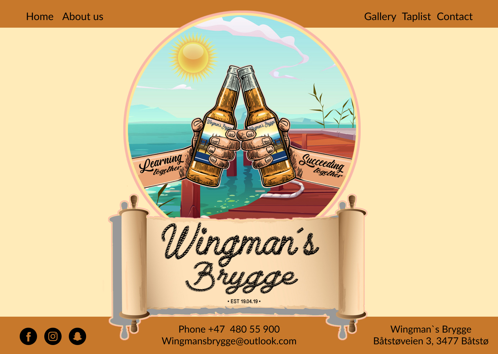

# Wingmans Brygge #
_True passion for exclusive and well made beer._

  

## Contents ##  

* UX    
    * Project goals  
    * User goals  
    * User stories  
    * Site owner goals  
    * User requirements and expectations  
    * Design choices  
        * Fonts  
        * Icons  
        * Colours
* Technologies  
* Features  
    * Features that have been developed  
    * Features that will be implemented in the future  
* Testing  
* Bugs  
* Deployment  
* Credit  
---
## UX (User Experience) ##  
  
### Project Goals ###  
This project`s goal is to help the site owners - the founders of Wingmans, to achieve their goal of inspiring others with their passion for home brew.  

### User Goals ###  
* Find inspiration for home brew  
* Images of home brew, the process, different beer types and equipment  
* Links to other social media for further inspiration  
* Ability to contact Wingmans directly by phone or email  
* Ability to get the **steps for success** directly from Wingmans by entering an e-mail address in the contact page and push _Start brewing with Wingman`s!_  

### User Stories ###  
* As a user I want to see a nice and inspiring website who makes me want to learn more about home brew  
* As a user I want to know the founders vision  
* As a user I want to see pictures of the founders and the home brew in action  
* As a user I want to read reviews from others who have had contact with the founders  
* As a user I want the ability to contact the founders for questions and guidance, and I also want the ability to let them contact me by leaving my e-mail address  

### Site Owner Goals ###  
* Inspire others with their work and passion for home brew  
* Help others get started with home brew
* Establish contact with others who share their passion  

### User Requirements And Expectations ###   

* Content that is visually appealing and well structured
* Easy to navigate the website using the navbar  
* Easy to read typography
* Operational links to other pages that open in a new tab  
* Operational contact form for e-mail address input  
* The website is quick to load  

### Credits ###  
Text used in this website is written by me in collaboration with the founders of Wingmans; Frode Olsen-Ryum and Lars-Petter Reitan.  
#### Setup and text in README.md ####  
* [byllsa](https://github.com/byIlsa/Aloy-from-outcast-to-heroine/blob/master/README.md) and [Miranda](https://github.com/mkthewlis/Milestone-Project-1) for clear, neat and inspiring readme files
* [Pumpkin](https://www.pumpkinwebdesign.com/web-design-manchester/top-user-expectations-for-web-design-in-2021/) for inspiration on _user requirements and expectations_ section  
