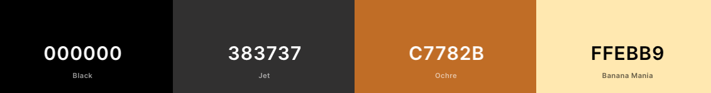

# Wingmans Brygge #
_True passion for exclusive and well made beer._

  

## Contents ##  

* UX    
    * Project goals  
    * User goals  
    * User stories  
    * Site owner goals  
    * User requirements and expectations  
    * Design choices  
        * Fonts  
        * Icons  
        * Colours  
        * Wireframes
* Technologies  
* Features  
    * Features that have been developed  
    * Features that will be implemented in the future  
* Testing  
* Bugs  
* Deployment  
* Credit  
---
## UX (User Experience) ##  
  
### Project Goals ###  
This project`s goal is to help the site owners - the founders of Wingmans, to achieve their goal of inspiring others with their passion for home brew.  
  
    
    Note; the review section is fictional as this is a new approach for The Wingmans.  
    It needed to be included as part of the assessment criteria.

### User Goals ###  
* Find inspiration for home brew  
* Images of home brew, the process, different beer types and equipment  
* Links to other social media for further inspiration  
* Ability to contact Wingmans directly by phone or email  
* Ability to get the **steps for success** directly from Wingmans by entering an e-mail address in the contact page and push _Start brewing with Wingman`s!_  

### User Stories ###  
* As a user I want to see a nice and inspiring website who makes me want to learn more about home brew  
* As a user I want to know the founders vision  
* As a user I want to see pictures of the founders and the home brew in action  
* As a user I want to read reviews from others who have had contact with the founders  
* As a user I want the ability to contact the founders for questions and guidance, and I also want the ability to let them contact me by leaving my e-mail address  

### Site Owner Goals ###  
* Inspire others with their work and passion for home brew  
* Help others get started with home brew
* Establish contact with others who share their passion  

### User Requirements And Expectations ###   

* Content that is visually appealing and well structured
* Easy to navigate the website using the navbar  
* Easy to read typography
* Operational links to other pages that open in a new tab  
* Operational contact form for e-mail address input  
* The website is quick to load  

### Design choices ### 
The design of this website has been created based on the logo of Wingmans and the personality of the founders.  
  
  As the site is ment to be an inspiration-page, but not with to much content as the founders also want to establish contact with others who may have, or in the future might get, the same passion; it was importent to keep the site simple and clean.  

Index page - contains only the navbar and footer who is the same at all pages, in addition to the logo.  
  
  About page - an evocative image at the top with a following introduction to the founders vision and picture. Then a smal review section at the end.  
    
Gallery page - representative images of Wingman's in action, process and equipment.  
  
  Contact page - contains a contact form with an exclusive wallpaper to break a little from the other pages and to create an evocative user.
* Fonts  

* Icons  
[Fontawsome](https://fontawesome.com/icons?d=gallery&p=2) provided the icons for [Facebook](https://fontawesome.com/icons/facebook-square?style=brands), [Instagram](https://fontawesome.com/icons/instagram-square?style=brands) and [Snapchat](https://fontawesome.com/icons/snapchat-square?style=brands).

* Colours  
All the colours were taken from the logo to ensure a harmonious expression.  
  
  * Navigation/footer: Ochre C7782B  
  * Background: Banana Mania FFEBB9  
  * Contact bg/text: Black 000000
  * Contact form: Cornsilk FFF6DF  
      
        
  Background colour on contact form was initially intended to be identical to the bg colour on the other pages, but became too yellow and needed to be adjusted to a lighter tone.  

  Color Scheme from [Coolors](https://coolors.co/)  

    

    
### Wireframes ###  
Wireframes are made in [Figma](https://www.figma.com/). This was a really nice program to check out different styles and how the final result would look like on different screensizes.  

#### Design for desktop devices: ####  
  
  
  

  

  

All designs for desktop, tablet and phone in Figma [here](https://www.figma.com/file/y1eSVjoA9x3tgVGvwsrd3O/Wingmans?node-id=19%3A2).  

### Technologies ###  
Languages  
* [HTML](https://no.wikipedia.org/wiki/HTML)  
* [CSS](https://en.wikipedia.org/wiki/CSS)  
* 

Tools / Libraries  
* [Git](https://git-scm.com/)  
* [Bootstrap](https://getbootstrap.com/)  
* [Fontawsome](https://fontawesome.com/)  
* [Google Fonts](https://fonts.google.com/)  
* [Unsplash](https://unsplash.com/)  
* [Coolors](https://coolors.co/)  

### Features ###  

Features that have been implemented:  
* Easy to navigate on all screensizes  
* Social media links  
* Link to [Taplist](https://taplist.io/)  
* Contact form with submit button  

Features that will be implemented in the future:  
* Video blog / link to youtube  
* Logbook  
* Forum  

### Testing ###  

### Bugs ###  

### Deployment ###  

### Credit ###  
Content and text used in this website is written by me in collaboration with the founders of Wingmans; Frode Olsen-Ryum and Lars-Petter Reitan.  
#### Setup and text in README.md ####  
* [byllsa](https://github.com/byIlsa/Aloy-from-outcast-to-heroine/blob/master/README.md) and [Miranda](https://github.com/mkthewlis/Milestone-Project-1) for clear, neat and inspiring readme files
* [Pumpkin](https://www.pumpkinwebdesign.com/web-design-manchester/top-user-expectations-for-web-design-in-2021/) for inspiration on _user requirements and expectations_ section  
  
#### Images ####  
About page - images is provided by [Unsplash](https://unsplash.com/). At the top from [Fred](https://unsplash.com/photos/0yqa0rMCsYk), and reviews from [Ivana](https://unsplash.com/photos/_7LbC5J-jw4), [Atikh](https://unsplash.com/photos/_KaMTEmJnxY) and [Amir](https://unsplash.com/photos/BFxyTaw3PsM).  
  
  Contact page - background image by [Pradnyal](https://unsplash.com/photos/1MqDCpA-2hU).
